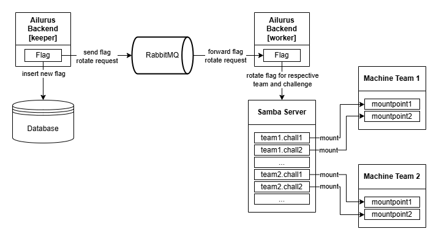
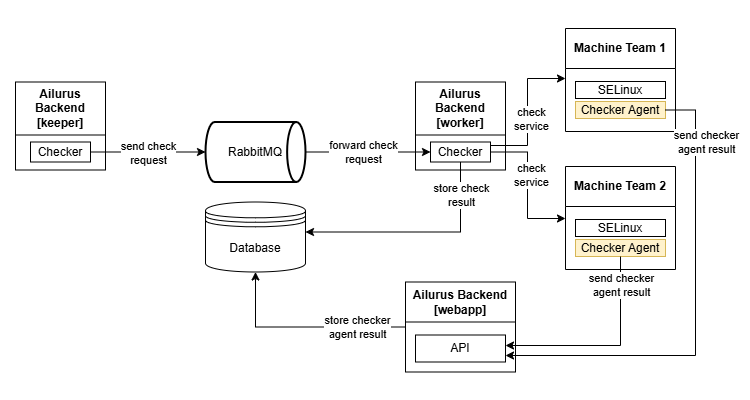

# Service Mode - AWS EC2
AWS EC2 service mode utilize AWS CloudFormation to provision the resources. There are (number of challenges + 1) flags on each machine, consisting of a flag for each challenge and a root flag. 

## Flag Rotator
Worker will overwrite the content of `/home/samba-flag/flags/<challenge_slug>-t<team_id>/flag.txt` in Samba server via SSH.



## Checker
There are several checker result messages:
- `valid`: Everything is working fine.
- `agent lost`: The checker agent did not send any new heartbeats.
- `flag missing`: The service seems to be working, but flags cannot be retrieved.
- `service faulty`: The service is reachable, but not working correctly.
- `not reachable`: The service is not reachable.
- `internal error`: Something went wrong with the checker.



## Service Manager
There are 5 action can be performed. However, participants can only execute `get_credentials` and `reset` actions.

### get_credentials
Get participants instance credentials.

API response:
```json
{
    "IP": "<Instance IPv4>", 
    "Username": "ubuntu",
    "Private Key": "<Instance private key in OpenSSH format>"
}
```

### reset
Reset participants instance without updating the credentials.

### provision
Provision participants instance. This action can only be performed on challenge with the lowest ID.

### infraprovision
Provision competition infrastructure resources, such as VPC and Samba instance. This action will generate new provision machine.

This action can only be called onces. You must delete the generated provision machine and the AWS Cloudformation stack before reperforming this action.

### delete
Delete participants instance from AWS and database.

## Leaderboard
Leaderboard sample data.
```json
[
    {
        "id": 1,
        "rank": 1,
        "name": "Team Name",
        "total_score": 0,
        "challenges": {
            "1": {
                "flag_captured": 12,
                "flag_stolen": 1,
                "attack": "12.34%",
                "defense": "98.7%",
                "sla": "100%"
            }, ...
        }
    }, ...
]
```